# Test-for-blockchain-of-blockchains-system
 protocols w.r.t cross-chain token exchange and cross-chain data interoperability

Version

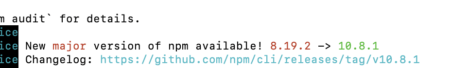

# DEPLOYMENT COST

## SCAMM

Mint coin。

We need to mint three types of ERC20 tokens on the BoB now: TK 1, TK 2,
and TK 3. Suppose TK 1 is the native token circulating on BCi; Figures 1
and 2 illustrate the creation process of TK 1. It is evident that a
total of 1,721,468 Gas was consumed to mint a single
token.
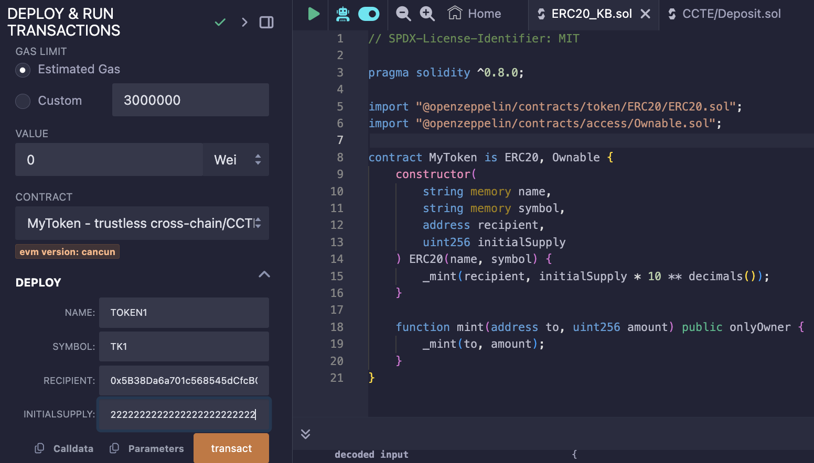
Figure 1

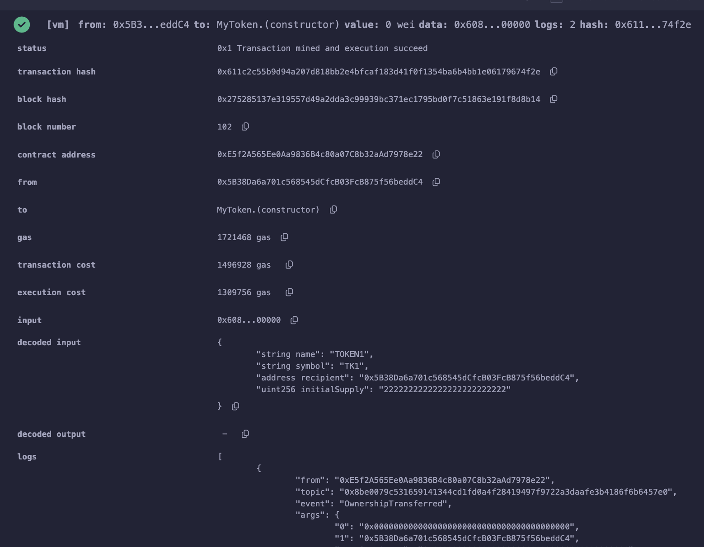
Figure 2

Thus, we use the same method to mint the three types of tokens, as shown
in Figure 3:

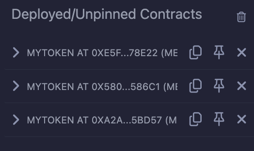

Figure 3

### Create liquidity pool

Assume that TK 2 is a native token circulating on BCj. TK 3 is a
stablecoin circulating on the BoB. Create an AMM contract on BoB and
create three liquidity pool LPS in that AMM contract. As shown in Figure
4 and Figure 5: 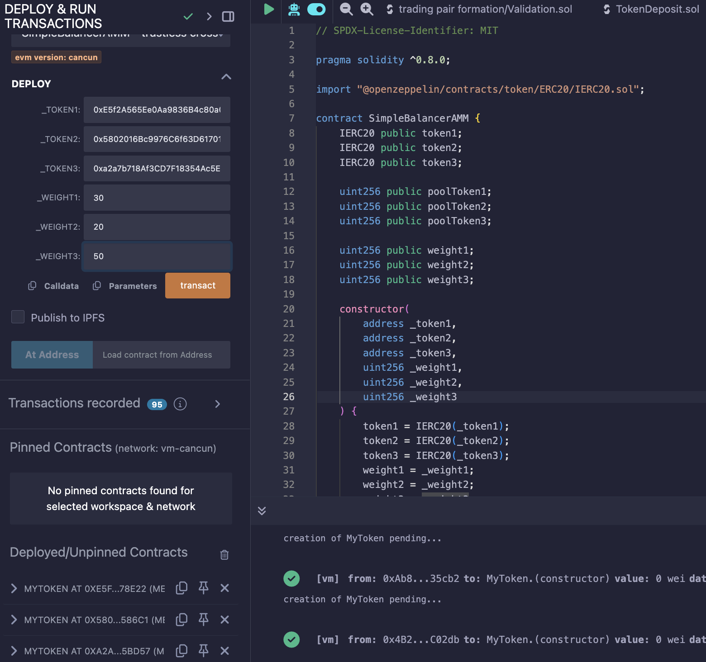

Figure 4

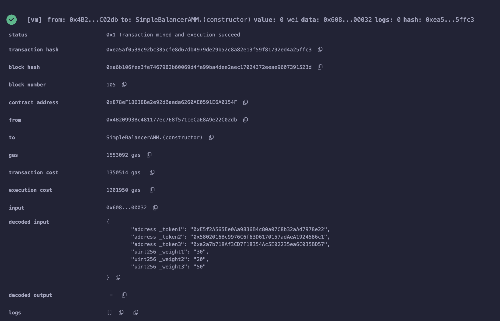

Figure 5

It can be seen that deploying an AMM with three LPs costs 1,553,092 Gas.

### Authorization

Then, have the owners of TK 1, TK 2, and TK 3 on the BoB, account 1,
account 2, and account 3, respectively, license right of using a certain
number of tokens to the AMM contract address. Figure 6 shows the process
of the account (0x5b38da6a701c568545dcfcb03fcb875f56beddc4) authorizing
the address (0x878ef18638be2e92dbaeda6260ae0591e6a0154f) of AMM contract
the right to use the tokens with type of TK 1:

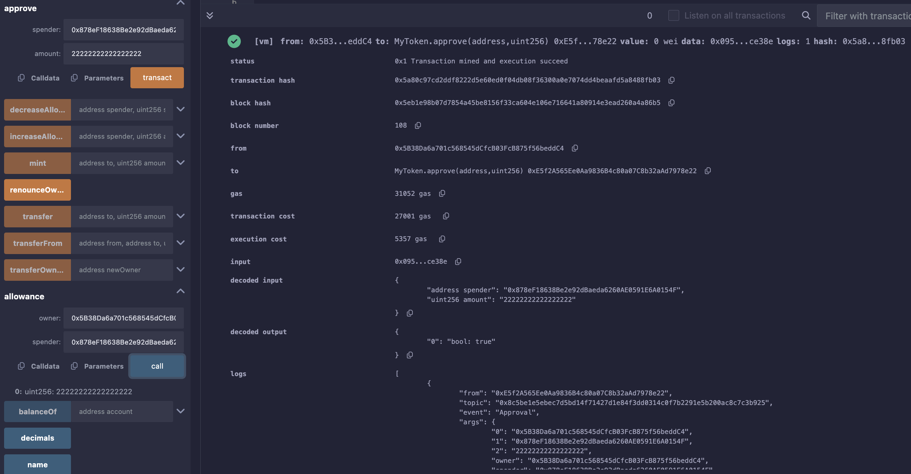

Figure 6

As you can see, the authorization process costs 31,052 Gas.

### Provide liquidity

Then, a portion of TK 1, TK 2, and TK 3 is placed into the corresponding
three LPs through the AMM contract, as shown in Figure
7:

Figure 7

As you can see, deploying three LPs costs a total of 266,452 Gas.

### The invocation of exchange rate

After the deployment of AMM contract, it can be called to return the
corresponding exchange rate, as shown in Figure 8:

Figure 8

As you can see from Figure 8, calling an AMM contract to query the
exchange rate once only costs 17,243 Gas.

Thus, the cost of obtaining the exchange rates in 1 CCTE process is
17,243\*2 Gas.

## Deployment of SCMPV

Next, we need to deploy the SCMPV contract first, followed by
the SCD contract. This is because the SCMPV
contract can call the function \`*confiscateAndWithdraw\`* in the
SCD contract to transfer the deposited tokens to another
account address. Therefore, when creating the SCD contract,
it is necessary to grant such permissions to the SCMPV
contract. The SCMPV contract will be invoked by proof
transactions, thus, it checks two time-related inequalities and verifies
the legality of the Merkle proof included in the proof transactions.
These two valid times include one from the deadline defined in the
SCT contract, and another valid time is when two instructions
are generated by the SCT contract. Upon receiving a proof
transaction, it is necessary to verify that the timestamp in the block
header included in the proof transaction is later than the time when the
two instructions were generated by the SCT contract; also, it
is required to obtain the latest local time, which needs to be before
the deadline. Therefore, after these two times are generated by the
SCT contract, they need to be inputted into the
SCMPV contract. Consequently, there is a function in the
SCMPV contract that is used to fetch and record these two
times. For security, the input to this function needs to include the
address of the SCT contract, then the function is executed to
fetch these two times from the address of the SCT contract,
and store them in the SCMPV contract.

Legal Merkle proof is stored in the SCMPV contract. When the
SCMPV contract stores a second legitimate Merkle proof, the
SCMPV contract emits a complete event.

There is also a trigger function in the SCMPV contract. Any
user can call this trigger function. The premise for using the trigger
function is that, at the deadline, the SCMPV contract has not
stored the two valid Merkle proofs. Once the trigger function is called,
the SCMPV contract will check 1) whether it has yet to store
two valid Merkle proofs; 2) whether the current time exceeds the
deadline. If both conditions are met, then the SCMPV contract
will invoke the \`*confiscateAndWithdraw\`* function in the
SCD and transfer the corresponding depositor’s TK3 to the
designated recipient. The specific logic for identifying the depositor
and the corresponding recipient in the BoB is based on the two
instructions generated in the SCT; each instruction’s sender field
contains one address, and each instruction’s receiver field also
contains one address. Additionally, it is necessary to consider the CCT.
The CCT is sent to the SCT contract by an address on the BoB and invokes
the \`*executeTransaction*\` function of the SCT contract. The address
sending the CCT corresponds to the address in the sender field of the
sender1instruction in the BoB, and this address has pledged a portion of
TK3 to the SCD. Moreover, the CCT includes a total of five
account addresses: the first address participant\[0\] is the address of
sender1 in BCi; the second address participant\[1\] is the address of
sender2 in BCj; the third address participant\[3\] is the address of
receiver1 in BCi; the fourth address participant\[3\] is the address of
receiver2 in BCj; the fifth address participant\[4\] is the pledging
address of sender2 in the BoB.

With this information, the depositor and the corresponding recipient
addresses in the BoB can be clearly identified: For the
sender1instruction, sender1 must use its address in the BoB—the address
that sent the CCT—to send a proof transaction to invoke the
SCMPV contract. Similarly, sender2 must use its address in
the BoB—participant\[4\]—to send a proof transaction to invoke the
SCMPV contract. Therefore, if the proof transaction
corresponding to the address that sent the CCT is not received, the TK3
deposited by the sending CCT address will be transferred to address
participant\[4\]; if the proof transaction corresponding to address
participant\[4\] is not received, the TK3 deposited by address
participant\[4\] will be transferred to the CCT sending address. Hence,
if the trigger function is correctly activated, it may invoke the
*\`confiscateAndWithdraw*\` function to initiate up to two transfers. As
shown in Figure 9, deploying SCMPV incurred a total cost of 1,271,187
Gas.

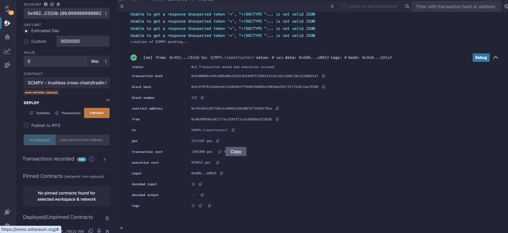

Figure 9

## Deployment of SCD

Then, we deploy SCD. As you can see from Figure 10, the total
cost of deploying SCD is 2,228,238 Gas.

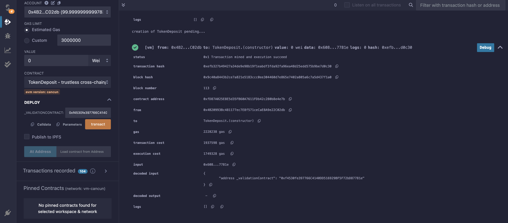

Figure 10

### Token transfer 

We then had account3 (the holder of the TK3 stablecoin) transfer a
portion of the stablecoin to account1 and account2. Figure 11 shows the
transfer of account3 to account1 tokens, costing a total of 59,963 Gas.

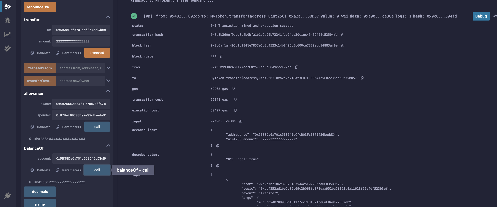

Figure 11

### Authorization

Then, in order for account1 and account2 to pledge their TK3 to
SCD, the SCD contract address needs to be
authorized. Figure 12 shows how account1 authorizing the SCD
contract address costs 53,895 Gas at a time.

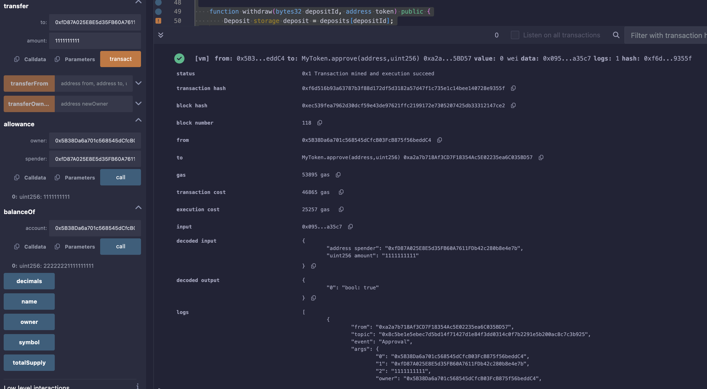

Figure 12

### Deposit

Next, account1 and account3 can deposit their TK3 to SCD, as
shown in Figure 13:

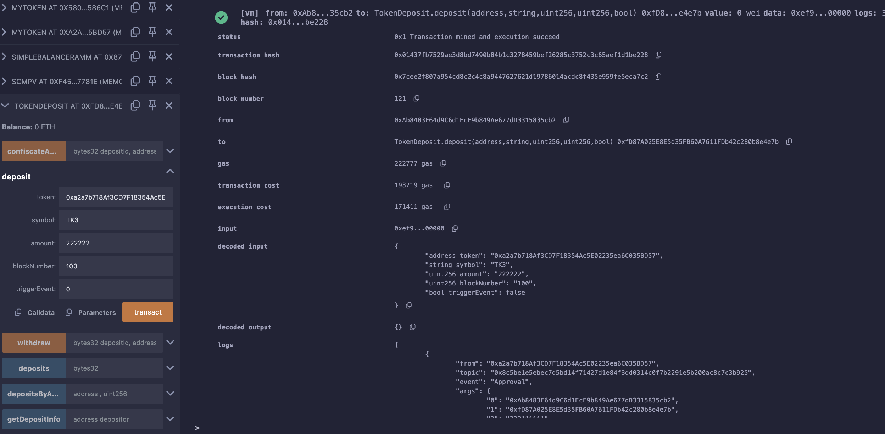

As you can see, a deposit operation costs 222,777 Gas. Figure 14 shows
the deposit information for account1：

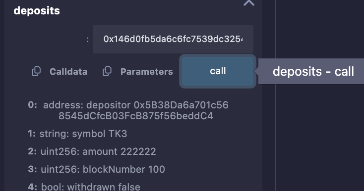

Figure 14

## SCT

After the deployment and operation of SCD. You are ready to
deploy SCT. As shown in Figure 15, you can see that the total
cost of deploying SCT is 1,561,365 Gas.

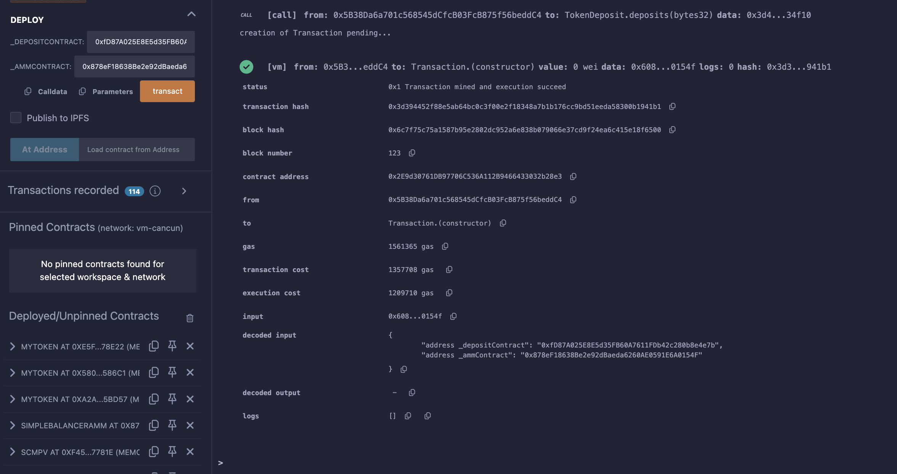

Figure 15

## Connecting SCMPV 

At this point, all deployment work has been completed, and it is now
necessary to inform SCMPV that the two contracts, SCD and SCT, have been
deployed. The two inform (inherit) operations cost 50,705 50730 Gas in
total), as shown in Figures 16 and 17:

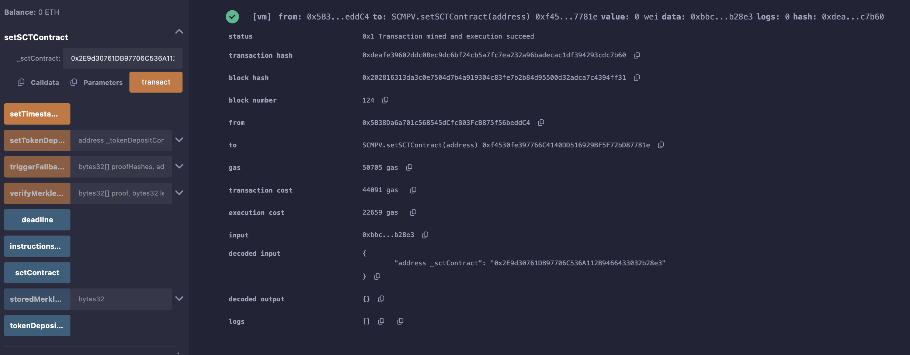

Figure 16

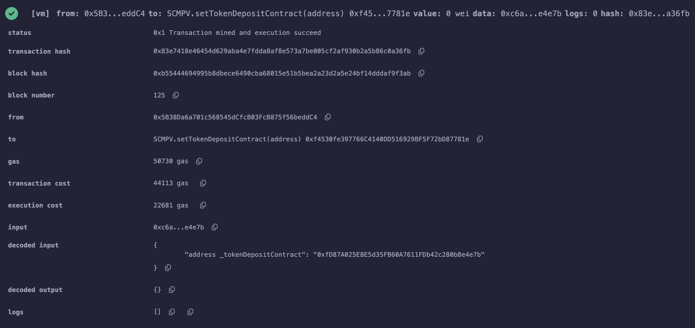

Figure 17

## Total Deployment cost

Now, we calculate the total deployment cost: SCAMM spent a total of
1,721,468\*3 Gas (for minting three types of tokens in the BoB) +
1,553,092 Gas (cost of deploying three LPs in SCAMM) + 31,052\*3 Gas
(cost for three authorization operations) + 266,452\*3 Gas (cost of
providing liquidity for three LPs); SCMPV incurred a total of 1,271,187
Gas; SCD spent 2,228,238 Gas (deployment cost) + 59,963\*2 Gas (transfer
costs) + 53,895\*2 Gas (authorization costs) + 222,777\*2 (staking
costs); SCT totalled 1,561,365 Gas. The cost to connect SCMPV with SCD
and SCT is 50,705 + 50,730 Gas. Thus, the final total expenditure is
13,344,068 Gas.

# The operation cost of CCTE 

The CCTE process is now officially open.

## The execution cost of CCT

Firstly, a cross-chain transaction (CCT) is sent to the BoB to invoke
the SCT's function \`*executeTransaction*\`. According to our
design, the sender of the CCT should be account1
(0x5B38Da6a701c568545dCfcB03FcB875f56beddC4). The CCT includes five
addresses: participant\[0\] is
0xdD870fA1b7C4700F2BD7f44238821C26f7392148, which is sender1’s address
on BCi; participant\[1\] is 0x583031D1113aD414F02576BD6afaBfb302140225,
which is sender2’s address on BCj; participant\[2\] is
0x4B0897b0513fdC7C541B6d9D7E929C4e5364D2dB, which is receiver1’s address
on BCi; participant\[3\] is 0x14723A09ACff6D2A60DcdF7aA4AFf308FDDC160C,
which is receiver2’s address on BCj; participant\[4\] is account2
(0xAb8483F64d9C6d1EcF9b849Ae677dD3315835cb2), which is the address of
sender2 in the BoB. Also the two token types involved in the exchange
are specified—TK 1 (0xE5f2A565Ee0Aa9836B4c80a07C8b32aAd7978e22) and TK 2
(0x5802016Bc9976C6f63D6170157adAeA1924586c1), along with the stablecoin
TK 3 (0xa2a7b718Af3CD7F18354Ac5E02235ea6C035BD57), and two locations
(BCi, which is participant\[5\]
(0xCA35b7d915458EF540aDe6068dFe2F44E8fa733c) and BCj which is
participant\[6\] (0x0A098Eda01Ce92ff4A4CCb7A4fFFb5A43EBC70DC)). Assume
sender1 wishes to exchange its TK1 for 22222 units of sender2's TK2.
Thus, CCT invokes SCT's function \`*executeTransaction*\` as shown in
Figures 18 and 19:"

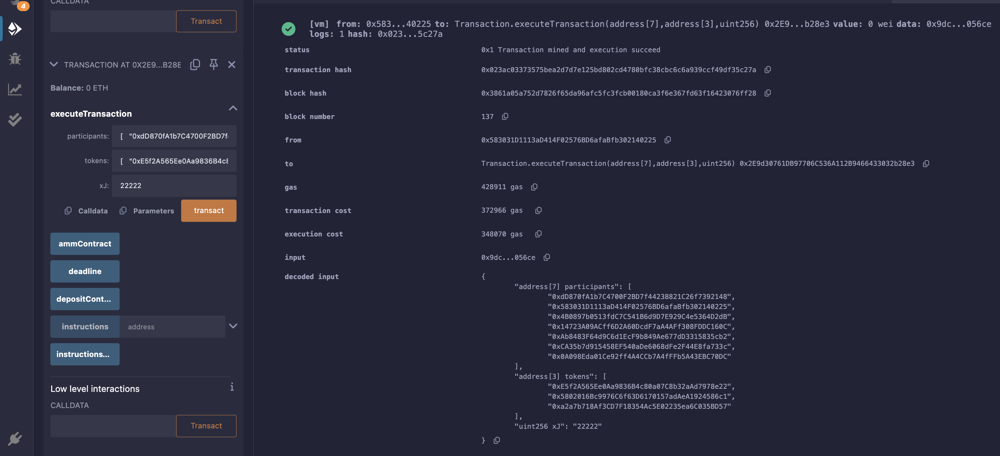

Figure 18

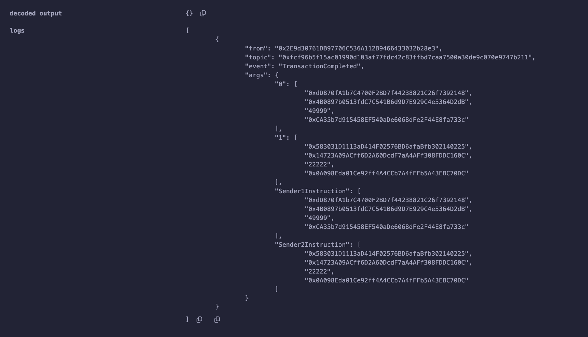

Figure 19

As shown in Figure 20, it takes 428,991 Gas to execute a CCT: generating
2 instructions, i.e., Sender1Instruction and Sender2Instruction, and
generating a deadline (237).

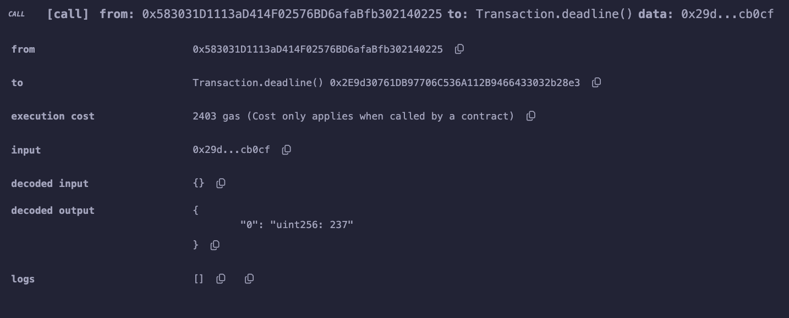

Figure 20

As shown in Figure 21, SCMPV then gets the deadline and the time to
generate the two instructions.
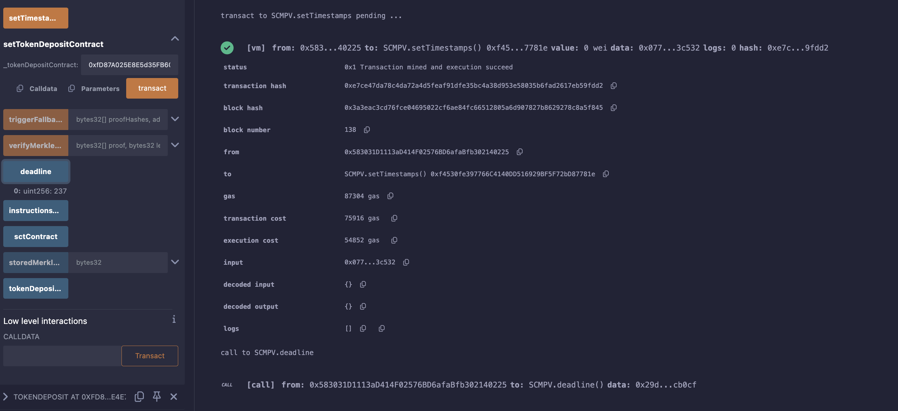

Figure 21

## The execution of Two native transaction

The cost of executing a transfer transaction based on a smart contract
is 59,963 Gas; The transfer cost of native tokens is 21,000 Gas.

## The execution cost of Proof transaction 

According to these 2 instructions, 2 transactions are executed and
completed in parallel on BCi and BCj. Then, as shown in Figure 22,
sender1 and sender2 generate two Merkle proofs and two proof
transactions and use the generated proof transactions to call SCMPV's
function verifyMerkleProof：

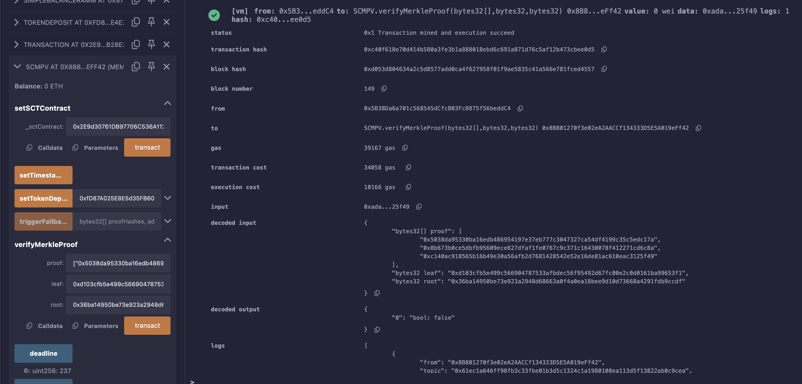

Figure 22

As you can see, executing a Proof transaction consumes 39,167 Gas.

## The total execution cost of CCTE

428,991 Gas （The execution cost of CCT）+21000\*2 Gas （the execution
cost of NT）+39,167\*2 Gas （the execution cost of PT）=549,325

Cross Chain data interoperability protocol

## Deployment of NFT

### Creation of the smart contract for minting NFT

The cost of creating the smart contract for minting NFT is shown in
Figure 23:

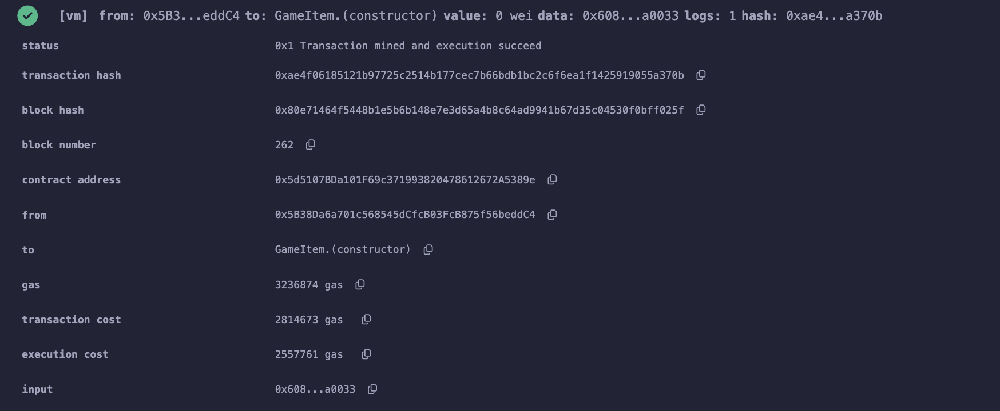

Figure 23

### Mint NFT 

The cost (265,479 Gas) for minting a NFT is shown in Figure 24:

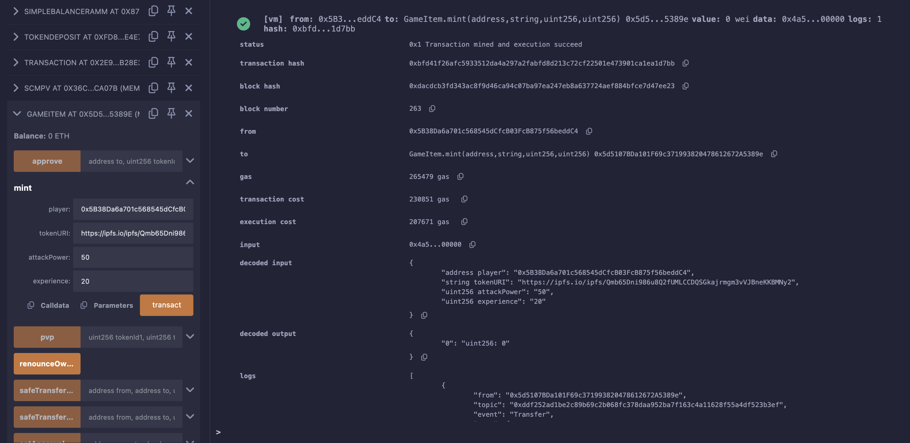

Figure 24

### PvP Game (Battle game)

Figure 25 shows the Gas cost for one PvP: 63,779 Gas. X SD items require
X(X-1)/2 times PvP.

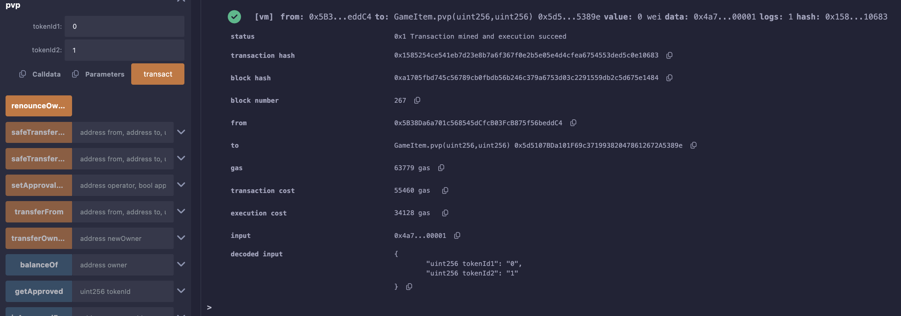

Figure 25

## The deployment of lock and burn to mint contract 

As shown in Figure 26, assuming that the deployment address is a
multi-signature address, it is necessary to enter the NFT contract of
ERC721 about PvP, blackhole address, and enter three time-related
parameters during deployment. As you can see, the total cost of
deploying this contract was 1,492,274 Gas.

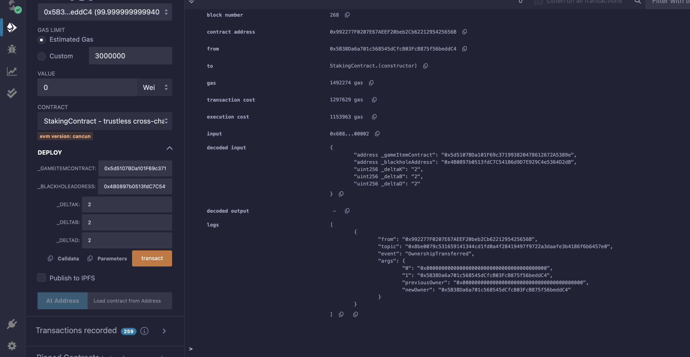

Figure 26

### lockingNFT

As shown in Figure 27, locking an NFT costs a total of 186,443 Gas.

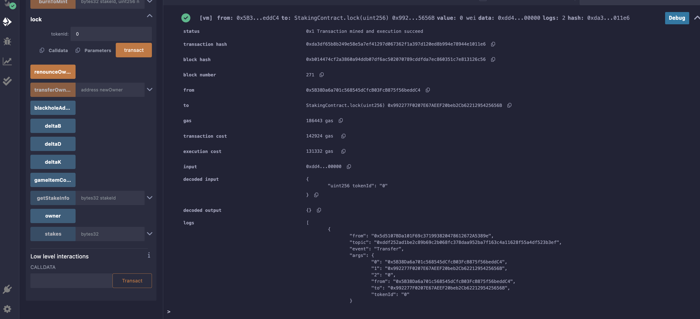

Figure 27

As shown in Figure 28, we can query the locked information and the owner
address of the locked NFT.

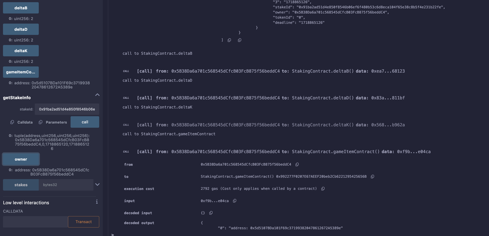

Figure 28

### The operation of Burn to mint 

As shown in Figure 29, we are directly testing the burn to mint
operation here, which is the only operation of Phase 3. The total cost
of this operation is 250,307 Gas.

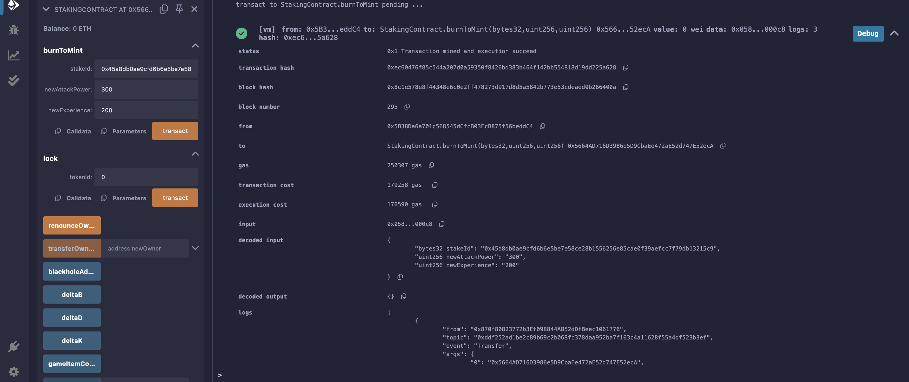

Figure 29

## Deployment of SCc

### SCc is for validating cross-chain transaction and storing the SD items in valid CCTs.

A Cross-chain transaction contains a transaction, a Merkle proof.

Verifying a cross-chain transaction requires verifying a Merkle proof. A
time parameter needs to be validated. If these two validations pass, the
NFT from the transaction in the Cross-chain transaction needs to be
stored in that contract.

(\*\* Because the article assumes that BoB's node stores the most recent
k (the secure parameter from common prefix property) block header of the
connected blockchain, when verifying Merkle proof, It is possible to
obtain the block number of the Merkle proof. Therefore, the node
determines whether the block in which the Merkle proof resides has
become stable according to the block number in the latest local block
header.)

As shown in Figure 30，The total cost of deploying the SCc was 1,140,863
Gas.

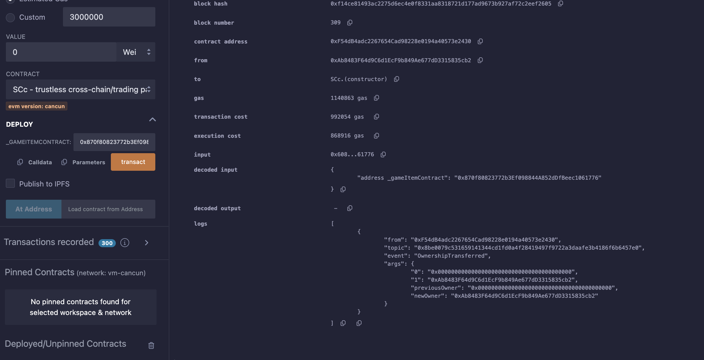

Figure 30

As shown in Figure 31, Sending a cross-chain transaction to call the
verifyAndStore function in SCc consumes 129,780 Gas.

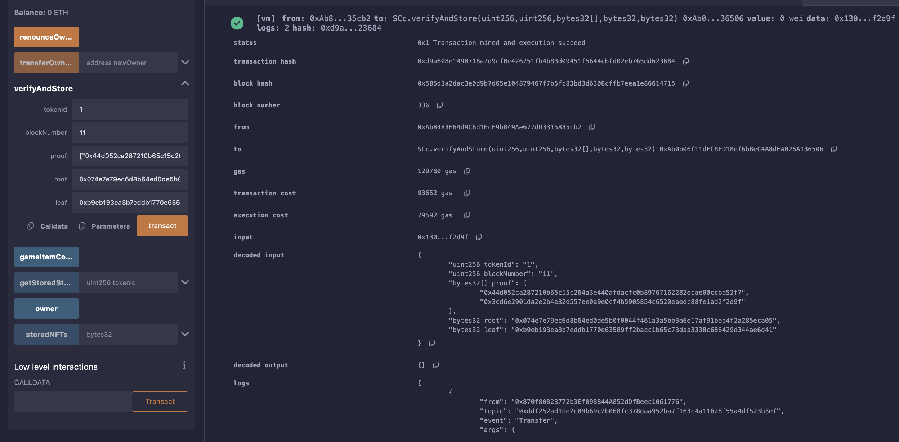

Figure 31

## The deployment of SCMPV

The deployment logic for SCMPV is the same as that for
SCC. The only difference is that SCC needs to
store SD and SCMPV needs to store Merkle proof. As shown in
Figure 32, the deployment cost of SCMPV is 1,020,615 Gas.

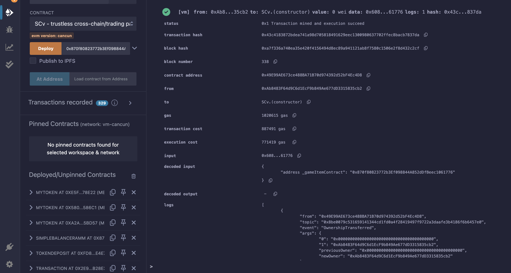

Figure 32

### The verification of proof transaction and the storage of valid Merkle proofs

The next step is to verify the Merkle proof and the time inequality. As
shown in Figure 33, the total cost of verifying the proof transaction
and the time inequality and storing the Merkle proof is 59,700 Gas.

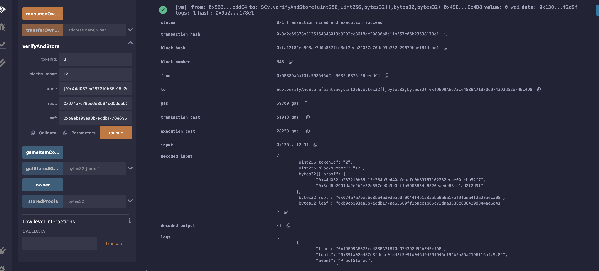

Figure 33

### Storing NFT

Now, let's test the cost of storing an NFT. As shown in Figure 34, we
first deploy the contract that stores the NFT.

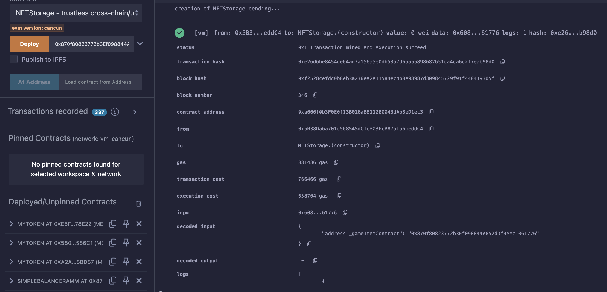

Figure 34

As shown in Figure 35, storing one NFT to this contract costs a total of
118,645 Gas.

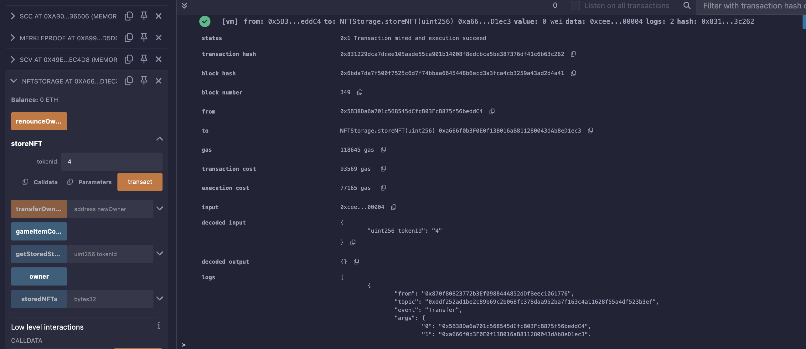

Figure 35

### Transferring NFT to blackhole address

As shown in Figure 36, we deploy a contract that includes store and burn
functionality.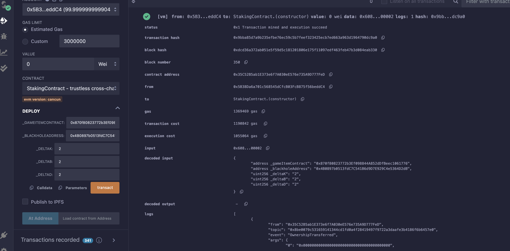

Figure 36

As shown in Figure 37, we then lock an NFT into the contract for a
period of time (using the lock function in
Phase1)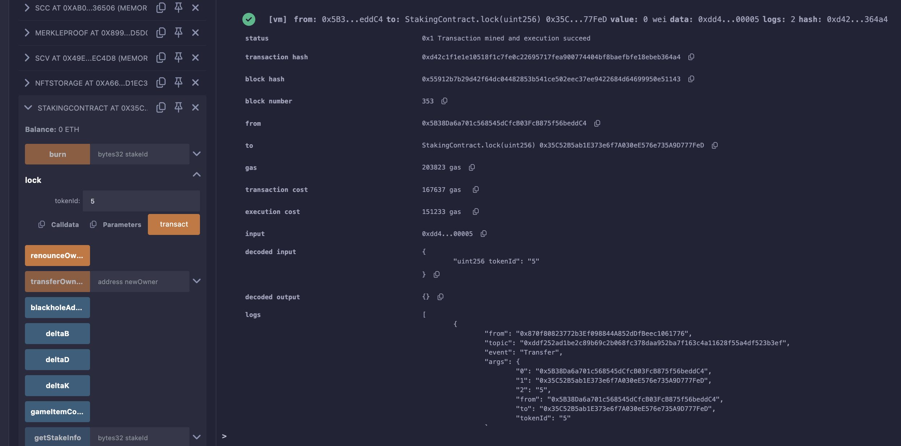

Figure 37

We then ask the contract to send this NFT to the black hole address when
the unlock time is up (we need to verify that the unlock time has passed
first). As shown in Figure 38, this execution time inequality and the
operator who sends the NFT to the black hole address consumes 114,478
Gas.

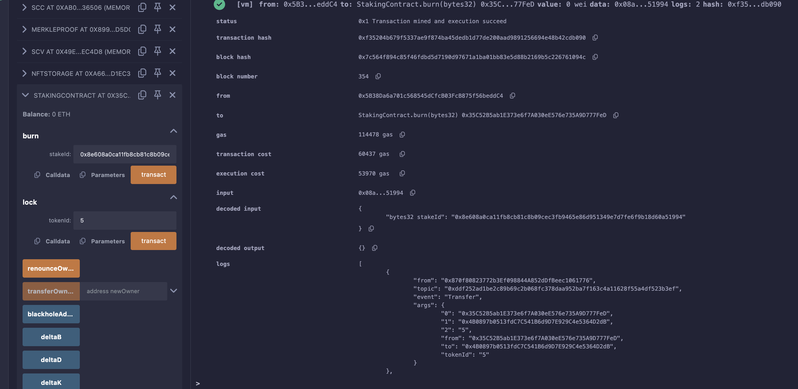

Figure 38

Thus, in Phase 1, a single Lock operation consumes 186,443 Gas. In Phase
2, there are three operations: the first is validating the cross-chain
transaction and storing the legitimate CCT’s SD, which consumes 129,780
Gas per execution. The second operation is executing PvP, consuming
63,779 Gas per execution. The third operation is storing the updated
NFT, with each storage consuming 118,645 Gas. In Phase 3, there is one
operation which is validating time inequalities and performing the 'burn
to mint' operation, consuming 250,307 Gas per execution. In Phase 4,
there are two operations: the first is validating the proof transaction
and storing the legitimate PT’s proof, with each operation consuming
59,700 Gas. The second is deleting the updated SD stored in Phase 2,
consuming 114,478 Gas per operation.

Therefore, assuming there are X SDs, Phase 1 consumes 186,443 \* X Gas;
Phase 2 consumes (129,780 + 118,645) \* X + 63,779 \* X \* (X-1) / 2
Gas; Phase 3 consumes 250,307 \* X Gas; Phase 4 consumes (59,700 +
114,478) \* X Gas.
